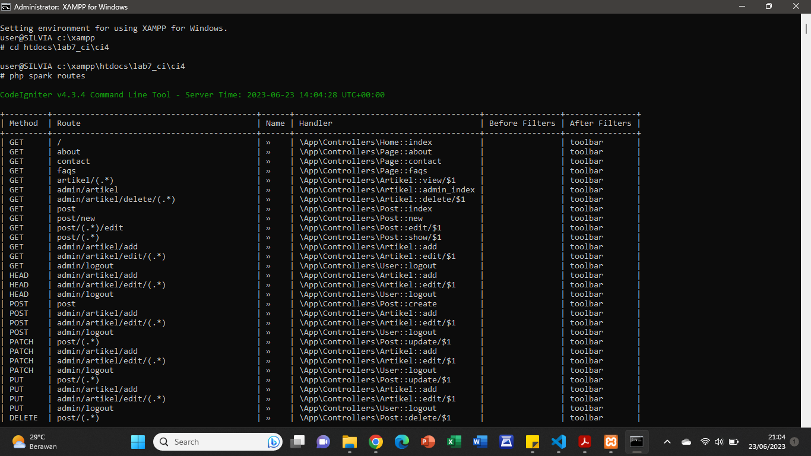
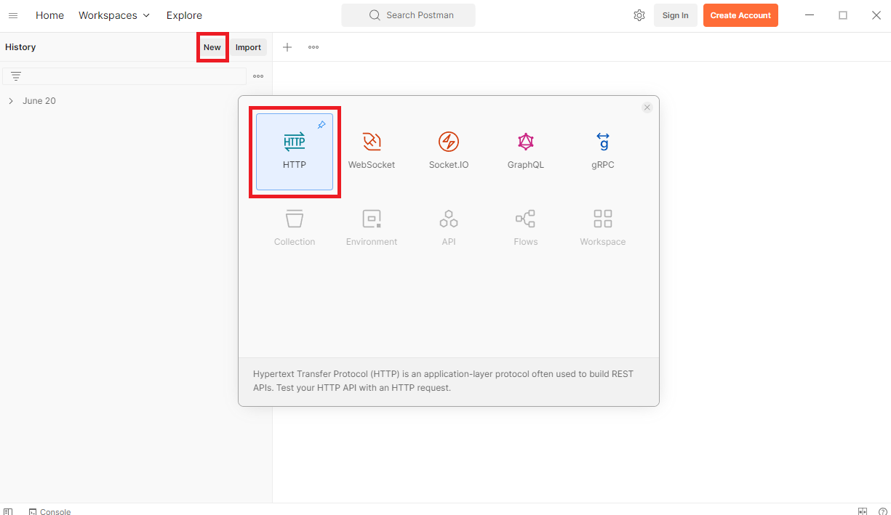
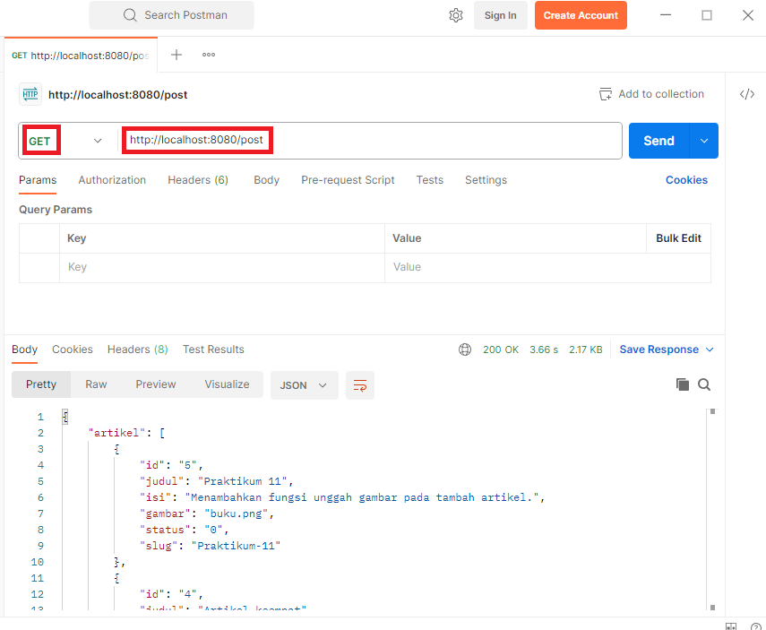
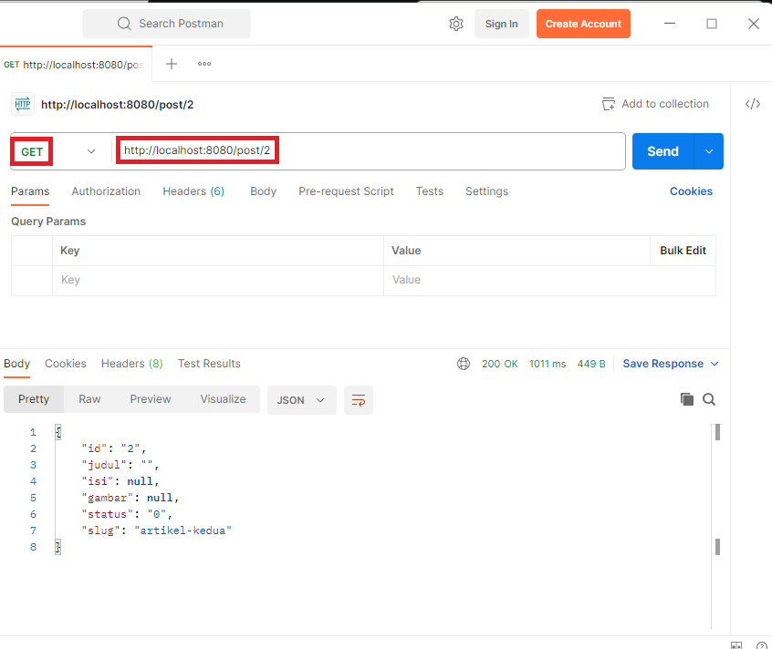
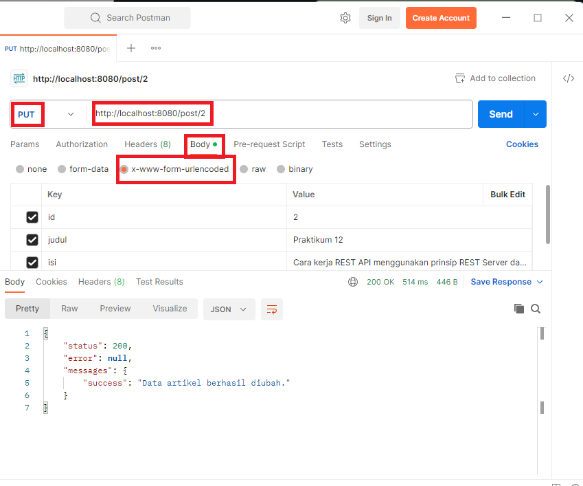
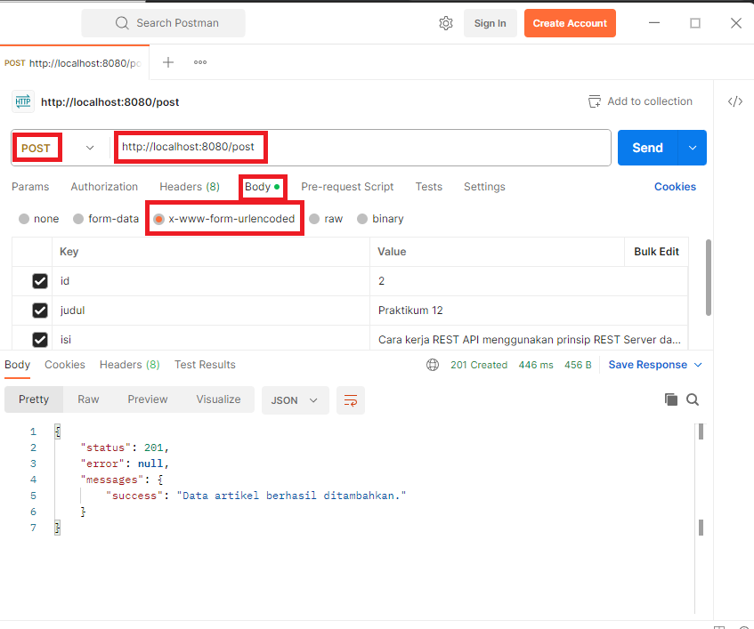

# Praktikum 12 - API

## REST API
*Representational State Transfer* (REST) adalah salah satu desain arsitektur *Application Programming Interface* (API). API sendiri merupakan interface yang menjadi perantara yang menghubungkan satu aplikasi dengan aplikasi lainnya.

REST API berisi aturan untuk membuat web service dengan membatasi hak akses client yang mengakses API. Kenapa harus demikian? Jika dianalogikan sebagai restoran, REST API adalah daftar menu. Pelanggan hanya bisa memesan sesuai daftar menu meskipun si koki (server) bisa membuatkan pesanan tersebut.

REST API bisa diakses atau dihubungkan dengan aplikasi lain. Oleh sebab itu, pembatasan dilakukan untuk melindungi database/resource yang ada di server.

## Cara kerja REST API menggunakan prinsip REST Server dan REST Client

REST Server bertindak sebagai penyedia data/resource, sedangkan REST Client akan membuat HTTP request pada server dengan URI atau global ID. Nantinya, server akan memberikan response dengan mengirim kembali HTTP request yang diminta client.

Nah, data yang dikirim maupun diterima ini biasanya berformat JSON. Itulah kenapa REST API mudah diintegrasikan dengan berbagai platform dengan bahasa pemrograman ataupun framework yang berbeda. Misalnya, Anda membuat backend project menggunakan REST API dengan bahasa pemrograman PHP. Nantinya, REST API tersebut bisa dihubungkan dengan frontend yang menggunakan Vue js.

## Langkah-langkah Praktikum

Persiapan awal adalah mengunduh aplikasi REST Client, ada banyak aplikasi yang dapat digunakan untuk keperluan tersebut. Salah satunya adalah **Postman**. Postman merupakan aplikasi yang berfungsi sebagai REST Client, digunakan untuk testing REST API. Unduh aplikasi [Postman](https://www.postman.com/downloads/).

## Membuat Model

Pada modul sebelumnya sudah dibuat **ArtikelModel**, pada modul ini kita akan memanfaatkan model tersebut agar dapat diakses melalui API.

## Membuat REST Controller

Pada tahap ini, kita akan membuat file **REST Controller** yang berisi fungsi untuk **menampilkan**, **menambah**, **mengubah** dan **menghapus data**. Masuklah ke direktori **app\Controllers** dan buatlah file baru bernama **Post.php**. Kemudian, salin kode di bawah ini ke dalam file tersebut:

```php
    <?php

    namespace App\Controllers;

    use CodeIgniter\RESTful\ResourceController;
    use CodeIgniter\API\ResponseTrait;
    use App\Models\ArtikelModel;

    class Post extends ResourceController
    {
        use ResponseTrait;
        // all users
        public function index()
        {
            $model = new ArtikelModel();
            $data['artikel'] = $model->orderBy('id', 'DESC')->findAll();
            return $this->respond($data);
        }
        // create
        public function create()
        {
            $model = new ArtikelModel();
            $data = [
                'judul' => $this->request->getVar('judul'),
                'isi' => $this->request->getVar('isi'),
            ];
            $model->insert($data);
            $response = [
                'status' => 201,
                'error' => null,
                'messages' => [
                    'success' => 'Data artikel berhasil ditambahkan.'
                ]
            ];
            return $this->respondCreated($response);
        }
        // single user
        public function show($id = null)
        {
            $model = new ArtikelModel();
            $data = $model->where('id', $id)->first();
            if ($data) {
                return $this->respond($data);
            } else {
                return $this->failNotFound('Data tidak ditemukan.');
            }
        }
        // update
        public function update($id = null)
        {
            $model = new ArtikelModel();
            #$id = $this->request->getVar('id');
            $data = [
                'judul' => $this->request->getVar('judul'),
                'isi' => $this->request->getVar('isi'),
            ];
            $model->update($id, $data);
            $response = [
                'status' => 200,
                'error' => null,
                'messages' => [
                    'success' => 'Data artikel berhasil diubah.'
                ]
            ];
            return $this->respond($response);
        }
        // delete
        public function delete($id = null)
        {
            $model = new ArtikelModel();
            $data = $model->where('id', $id)->delete($id);
            if ($data) {
                $model->delete($id);
                $response = [
                    'status' => 200,
                    'error' => null,
                    'messages' => [
                        'success' => 'Data artikel berhasil dihapus.'
                    ]
                ];
                return $this->respondDeleted($response);
            } else {
                return $this->failNotFound('Data tidak ditemukan.');
            }
        }
    }
```

Kode diatas berisi 5 method, yaitu:
* **index()** – Berfungsi untuk menampilkan seluruh data pada database.
* **create()** – Berfungsi untuk menambahkan data baru ke database.
* **show()** – Berfungsi untuk menampilkan suatu data spesifik dari database.
* **update()** – Berfungsi untuk mengubah suatu data pada database.
* **delete()** – Berfungsi untuk menghapus data dari database.

## Membuat Routing REST API

Untuk mengakses REST API CodeIgniter, kita perlu mendefinisikan route-nya terlebih dulu.

* Masuklah ke direktori **app/Config** dan bukalah file **Routes.php**. Tambahkan kode di bawah ini:

    ```php
        $routes->resource('post');
    ```

* Untuk mengecek route nya jalankan perintah berikut:

    ` php spark routes `

* Selanjutnya akan muncul daftar route yang telah dibuat.

    


* Seperti yang terlihat, satu baris kode routes yang di tambahkan akan menghasilkan banyak Endpoint.

## Testing REST API CodeIgniter

* Buka aplikasi **postman** dan pilih **create new → HTTP Request**.
  
    


## Menampilkan Semua Data

* Pilih method **GET** dan masukkan URL berikut: http://localhost:8080/post

* Lalu, klik **Send**. Jika hasil test menampilkan semua data artikel dari database, maka pengujian berhasil.

    


## Menampilkan Data Spesifik

* Masih menggunakan method **GET**, hanya perlu menambahkan ID artikel di belakang URL seperti ini: http://localhost:8080/post/2
  
* Selanjutnya, klik **Send**. Request tersebut akan menampilkan data artikel yang memiliki ID nomor 2 di database.

    


## Mengubah Data

* Untuk mengubah data, silakan ganti method menjadi PUT. Kemudian, masukkan URL artikel yang ingin diubah. Misalnya, ingin mengubah data artikel dengan ID nomor 2, maka masukkan URL berikut: http://localhost:8080/post/2
  
* Selanjutnya, pilih tab **Body**. Kemudian, pilih **x-www-form-uriencoded**. Masukkan nama atribut tabel pada kolom **KEY** dan nilai data yang baru pada kolom **VALUE**. Kalau sudah, klik **Send**.

    


## Menambahkan Data

* Anda perlu menggunakan method **POST** untuk menambahkan data baru ke database. Kemudian, masukkan URL berikut: http://localhost:8080/post
  
* Pilih tab **Body**, lalu pilih **x-www-form-uriencoded**. Masukkan atribut tabel pada kolom **KEY** dan nilai data baru di kolom **VALUE**. Jangan lupa, klik **Send**.

    


## Menghapus Data

* Pilih method **DELETE** untuk menghapus data. Lalu, masukkan URL spesifik data mana yang ingin di hapus. Misalnya, ingin menghapus data nomor 4, maka URL-nya seperti ini: http://localhost:8080/post/2
  
* Langsung saja klik **Send**, maka akan mendapatkan pesan bahwa data telah berhasil dihapus dari database.

    


## Terimakasih!